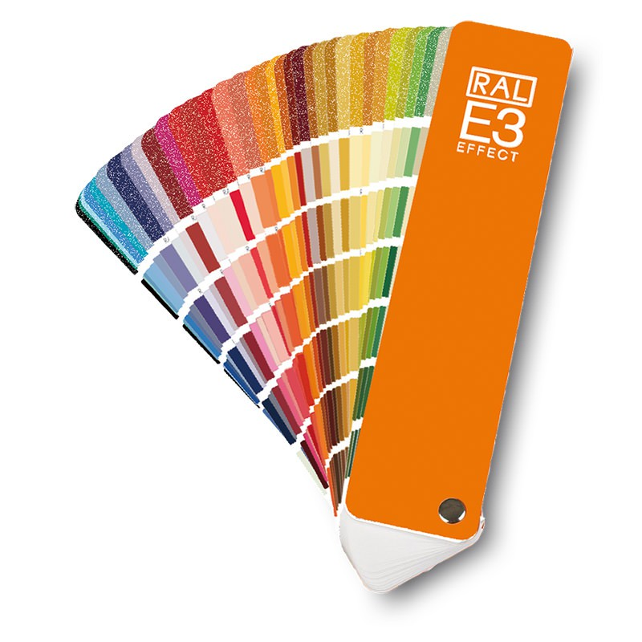

# **R6.Crea.02** | Création numérique interactive
## Imaginer et concevoir un portfolio virtuel et interactif
### Slogan : Mon nuancier de domaines

Créations : * un site web d'accueil des différentes scènes
            * un nuancer de cartes de visites (Tous mes domaines + 3 scènes (confier au préalable)
            * 3 expériences créer avec A-frame

> Fichier en plus : Fichier Ai pour les créations réalisé pour toutes les scènes

## Projet : Mon portfolio

### Mon univers
Ce que je veux montrer c'est la passion que j'ai pour la création numérique mais aussi pour le print. Et donc pour changer de mes habitudes et de me chalenger, j'ai décidé de réaliser mon projet dans un style **Pixel-Art**. 

### Mon slogan
Comme vous pouvez le comprendre dans mon slogan qui est :
> Mon nuancier de domaines

Je voulais mélanger les univers de la création numérique et du print avec un concept de nuancier de couleur

